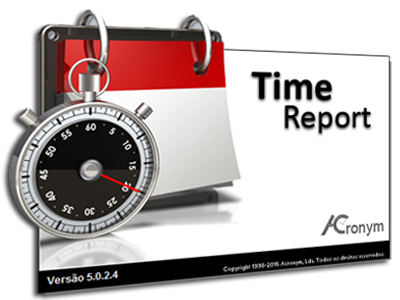
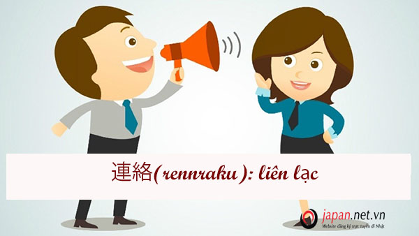

# HORENSO

ほうれんそう

## HORENSO là gì

---

- Horenso là một trong những quy tắc quan trọng mà khi làm việc ở bất kỳ công ty nhật nào nhân viên cũng được đào tạo. Horenso không chỉ là phương pháp truyền thông liên lạc nội bộ mà còn là nét văn hóa của Nhật Bản.

- HORENSO là viết tắt của 3 từ sau:
  - HO - HOKOKU : Báo cáo  ほう
  - REM - RENKAKU : Liên lạc   れん
  - SO - SODAN : Bàn bạc   そう

### HO-HOKOKU: Báo cáo

---

- Ta phải nhận định rằng báo cáo là một nhiệm vụ quan trọng và bắt buộc phải làm. Để cho cấp trên có thể nắm được rõ tình hình công việc của mình đang làm, nếu không cấp trên sẽ không biết tiến độ công việc ra sao để đưa ra những hướng đi hợp lý. Không nên chờ cấp trên hỏi về tiến độ công việc, nên chủ động báo cáo công việc.

- **Những điểm lưu ý về báo cáo:**
  - ***Thời điểm báo cáo.***
    - Khi kết thúc công việc được giao.
    - Với những task có thời gian dài nên báo cáo tiến độ công việc tránh việc thời gian quá dài mà cấp trên không biết tiến độ công việc đã đến đâu.
    - Khi có gì thay đổi khi làm task.
    - Khi thu thập được thông tin gì mới.
    - Khi gặp vấn đề.
    - Khi cần cải tiến công việc hoặc tìm ra phương pháp làm việc mới.
  - ***Thế nào là phương pháp báo cáo tốt.***
    - Thường xuyên, chính xác, đầy đủ, cái gì xấu nói trước tốt nói sau, văn phong phải lịch sự tôn trọng người nhận báo cáo.
    - Thông tin báo cáo phải có chọn lọc và đầy đủ.
    - Góp ý, đưa ra giải pháp luôn.
    - Trong vài trường hợp cấp bách có thể báo cáo bằng miệng trực tiếp luôn.
    - Có thể báo cáo bằng văn bản nếu nội dung đặc thù hay khó hiểu có thể dùng hình vẽ, biểu đồ ... cho dễ hiểu.
    - Báo cáo bằng mail.
  - ***Thế nào là phương pháp báo cáo không tốt.***
    - Ngẫu hững, không chính xác.
    - Quá ít thông tin.
    - Báo tin tốt trước.
    - Văn phong thiếu tôn trọng.
    - Chỉ hỏi và tham khảo.

### RENKAKU: Liên lạc

---

- Trong phương pháp horenso liên lạc là khó nhất. Dùng để chia sẻ thông tin với đồng nghiệp, cấp trên, cấp dưới... để cho mọi người trong team có thể phối hợp với nhau hiệu quả. Ví dụ khi làm việc nếu có một thay đổi yêu cầu bất kì từ phía khách hàng thì liên lạc là cách nhanh nhất để mọi người có thể nắm bắt được những yêu cầu thay đổi hay cũng như việc báo cáo công việc trong điều kiện không cho phép, hay gặp vấn đề gì đó ta phải liên lạc với sếp,thành viên trong nhóm bằng cách sử dụng email hay các phần mềm chuyên dùng để liên lạc hiệu quả như: teams, skype, telegram...

- ***Thế nào là phương pháp liên lạc tốt.***
  - Thông tin dễ đọc.
  - Nhanh, kịp thời (realtime) nên sử dụng các hình thức truyền tin nhanh nhất có thể như các phần mềm liên lạc như teams, skype, telegram...
  - Càng nhiều người biết càng tốt để vấn đề có thể xử lý nhanh.
  - Thực hiện liên lạc đều đặn

- ***Thế nào là phương pháp liên lạc không tốt.***
  - Trong khi cả nhóm ngồi gần nhau thay vì truyền tin bằng miệng thì lại sử dụng email, các phần mềm để liên lạc với nhau.
  - Ít người biết.
  - Nội dung liên lạc khó hiểu, dài dòng người đọc khó hình dung.
